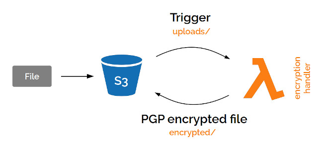

# Serverless Lambda Demo

This repo contains demo code that was used in my presentation about **Serverless** using AWS Lambda.

## Architecture

The system architecture designed to demonstrate the use of AWS Lambda function is shown below.



## Before starting

First of all, in order to deploy and run this code, you must have an active [AWS account](https://aws.amazon.com/resources/create-account/).

## Steps for demo

1) Generate a PGP key (see [PGP section](#pgp)).

2) Create a [S3 bucket](https://docs.aws.amazon.com/AmazonS3/latest/dev/UsingBucket.html#create-bucket-intro) on AWS.

3) Create 2 folders in the bucket:

    - _uploads/_ - files will be uploaded here
    - _encrypted/_ - encrypted files will be pasted here

4) Create a [Lambda function](https://docs.aws.amazon.com/lambda/latest/dg/getting-started-create-function.html) on AWS (e.g. _encrypt-s3-files_).

5) Create a Lambda package locally from source files (see [deploy section](#deploy-package)).

6) Upload this package (_dist.zip_ file) to your Lambda function.

7) Configure Lambda handler to _"lambda.encryptS3File"_.

8) Configure Lambda timeout to _15 seconds_.

9) Save changes.

10) From Lambda designer, add a S3 trigger to your Lambda function with the following configurations:

    - Event type: _PUT_
    - Prefix: _uploads/_

11) Upload a file to the _uploads/_ folder.

12) Check Lambda logs in [CloudWatch](https://aws.amazon.com/cloudwatch/).

**Optional:** Configure environment variables as needed (optional, see [variables section](#environment-variables)).

## Deploy package

Create a deploy package to upload to AWS Lambda by running the command below:

```
$ npm run build
```

A `dist.zip` file will be created and may be uploaded to AWS Lambda.

## Environment variables

Lambda function uses those environment variables that are configurable, but optional.

| Variable | Description | Default value |
| -------- | ----------- | ------------- |
| S3_ENCRYPTED_PREFIX | Prefix for encrypted files. | `'encrypted/'` |
| S3_API_VERSION | S3 API version. | `'2006-03-01'` |

## PGP

Generate a PGP key.

```
$ gpg --gen-key
```

Use info below:

```
Real name: Serverless Demo
Email address: serverless@demo
```

Export the PGP pub key.

```
$ gpg --armor --export serverless@demo > src/pub.key
```

## Danger zone

You can also delete the secret/pub keys if it's not used anymore.

**BE CAREFUL, IT CAN'T BE UNDONE**

```
$ gpg --delete-secret-key serverless@demo # secret
$ gpg --delete-key serverless@demo # pub
```

---
August 2019, design and code by [Alexandre Bolzon](https://about.me/bolzon).
